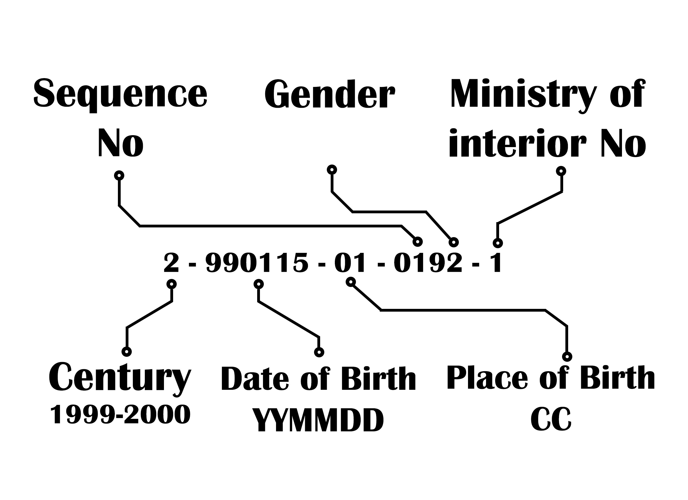

# National ID Validator

This project is to build an Egyptian national ID validator and data-extractor API.

The task for the project was to create an API for implementing the following functionality:

1) Check that the National ID sent is a valid one.
2) Extract any relevant information you can from the number such as the birth year. 


## Getting Started


### Installing Dependencies
Developers using this project should already have Python3, vagrant, virtual box, and pip installed.

### Starting vagrant server
vagrant server is already configured you just need to start it

### within your project directory `/vagrant` run this to start the server:
```bash
vagrant up
```
### Establish connection to server termial
```bash
vagrant ssh
```


### Starting virtual environment
```bash
python -m venv ~/env
```

### Activate env
```bash
source ~/env/bin/activate
```


Once you have your virtual environment setup and running, install dependencies by naviging to the `/vagrant` directory and running:

```bash
pip install -r requirements.txt
```


## Running the Server

From within the `/vagrant` directory first ensure you are working using your created virtual environment.

To run the server, execute:

```bash
python manage.py runserver 0.0.0.0:8000
```

this will run the server on 127.0.0.1:8000 on your local server 


## ID format 



* Century           : (2) is the birth century (2 represent 1900 to 1999, 3 represent 2000 to 2099 .. etc)

* Date of birth     : yymmdd (200115) is the date of birth, yy(99) year,mm(01) month, dd(15) day

* Place of pirth    : CC(01) birth governorate coda (88 for people who born in a foreign country, 01 for who born in Cairo,..etc )

* Sequence No       : (0192) the sequence in the computer between births in this birthday

* Gender            : (2) represent the gender (2,4,6,8 for females and 1,3,5,7,9)

* Min of Interior No: (1) number Ministry of Interior added it to validate if the National ID fake or not (1 to 9)

source : `https://codereview.stackexchange.com/questions/221899/extract-information-from-egyptian-national-id`


## Validaion criteria
* input must be 14 digit integer
* century digit must be 2 or 3
* government code digits must be in gov code list
* date of birth validation 
  * date of birth digits must be a valid date format
  * century digit have a valid correspondent birth date 


## API Reference

### Getting Started

* Base URL: Currently this application is only hosted locally. The backend is hosted at `http://127.0.0.1:8000/`
* Authentication: This version does not require authentication or API keys.


### Endpoints

#### GET /NIDs

* General: Returns a list of National Ids.
* Sample: `curl http://127.0.0.1:8000/NIDs/`<br>

        {
            "id": 19,
            "national_id": 29501023201952,
            "date_of_birth": "1995-01-02",
            "place_of_birth": "New Valley",
            "gender": "Male"
        },
        {
            "id": 20,
            "national_id": 29501023201942,
            "date_of_birth": "1995-01-02",
            "place_of_birth": "New Valley",
            "gender": "Female"
        },
        {
            "id": 21,
            "national_id": 29501028801942,
            "date_of_birth": "1995-01-02",
            "place_of_birth": "Foreign",
            "gender": "Female"
        },
        {
            "id": 22,
            "national_id": 29001011234567,
            "date_of_birth": "1990-01-01",
            "place_of_birth": "Dakahlia",
            "gender": "Female"
        }

        

#### POST /NIDs

This endpoint creates a national id upon validations  

* General:
  * Validates and creates a new id .
  * Returns JSON object with newly created id.
* Sample: `curl -X POST -d 'national_id=29501023201959' http://127.0.0.1:8000/NIDs/'`<br>

        {
            "id": 24,
            "national_id": 29501023201959,
            "date_of_birth": "1995-01-02",
            "place_of_birth": "New Valley",
            "gender": "Male"
        }


#### GET /NIDs/\<int:id\>/

* General:
  * Gets national id by id using url parameters.
  * Returns JSON object with matching national id.
* Sample: `curl http://127.0.0.1:8000/NIDs/22/`<br>

        {
            "id": 22,
            "national_id": 29001011234567,
            "date_of_birth": "1990-01-01",
            "place_of_birth": "Dakahlia",
            "gender": "Female"
        }

